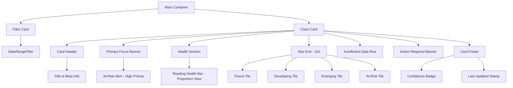

# Reading Analytics & Reading Status Documentation

This document provides a technical overview of how student reading status is fetched, calculated, and visualized within the application. It covers both the data aggregation logic and the UI architecture for consistent replication.

---

## 1. Data Fetching & Calculation Logic

### A. Class Activity (Admin)
**Component:** `ClassStatusChart.tsx`  
**Hook:** `useClassMetrics(acadYear)`

*   **Source:** Fetches all classes via `AuthenticationController.getAllClasses`.
*   **Aggregation:**
    *   Iterates through classes to count `status === 'active'` and `status === 'archived'`.
    *   Calculates percentage distribution: `(activeCount / total) * 100`.
*   **Purpose:** Monitors class lifecycle and engagement across the institution.

### B. Student Reading Health (Faculty)
**Component:** `ClassReadingStatus.tsx`  
**Hook:** `use_ClassReadingHealth.ts`

This is the core diagnostic engine. It uses a **Weighted Multi-Factor Scoring System** to categorize students.

#### The Formula
Reading status is NOT just based on accuracy; it combines three key performance indicators (KPIs):

| KPI | Weight | Normalization |
| :--- | :--- | :--- |
| **Accuracy Rate** | 50% | Raw percentage of correct words. |
| **Fluency (WPM)** | 30% | Normalized against Grade-Level targets (e.g., Grade 3 = 110 WPM). |
| **Miscue Density** | 20% | Errors per 100 words, adjusted for passage complexity. |

#### Advanced Logic
1.  **Recency Weighting:** Uses linear decay to give higher importance to recent assessments (Recent = 1.0 weight, Oldest = 0.1).
2.  **Trend Bonus:** Adds `+3` points for "improving" trends or `-3` for "declining" trends.
3.  **Accuracy Guardrail:** If Accuracy is **< 70%**, the student is automatically flagged as **"At Risk"** regardless of WPM.
4.  **Thresholds:**
    *   **Fluent:** Score ≥ 88
    *   **Developing:** Score 75–87
    *   **Emerging:** Score 55–74
    *   **At Risk:** Score < 55 (or < 70% Accuracy)

---

## 2. UI Structure & Design Layout
**Target:** `ClassReadingStatus.tsx`

To maintain UI consistency when replicating this component, follow this hierarchical structure:

### A. Main Layout Hierarchy

### B. Component Breakdown

#### 1. The Class Card (`ClassCard`)
The main container for class-level analytics.
*   **Visual Style:** White background, rounded corners (16px), subtle shadow, and consistent padding (18px).
*   **Header:** Displays the Class Name in Bold (`Poppins-Bold`) and a sub-row with student count and participation rate.

#### 2. Primary Focus Banner (`AtRiskHighlight`)
*   **Function:** Draws immediate attention to students needing intervention.
*   **Style:** Uses a "Soft Red" background with a thick left-accent border.
*   **Logic:** Only shows "Needs Your Attention" if the At-Risk count > 0; otherwise, shows a "Safe" green banner.

#### 3. Health Bar (`HealthBar`)
*   **Style:** A slim (6px height) segmented progress bar.
*   **Logic:** Maps the percentages of each category to the width of colored segments.
*   **Colors:** Fluent (Green), Developing (Yellow), Emerging (Orange), At Risk (Red).

#### 4. Stat Grid (`StatTile`)
*   **Layout:** A 2x2 grid using `flexWrap: 'wrap'` and `width: '48.5%'`.
*   **Content:** Top color-indicator bar, category label, count (large), and percentage (small).

#### 5. Action Alert (`alertBanner`)
*   **Style:** Yellow warning box.
*   **Logic:** Appears only when specific conditions are met (e.g., participation rate < 60% or > 20% students are At Risk).

#### 6. Student List Modal
*   **Trigger:** Tapping any Stat Tile or the At-Risk Banner.
*   **Features:**
    *   **Header:** Dynamic title based on selection.
    *   **Search Bar:** Filter student list locally.
    *   **FlatList:** Shows student rank, name, Average Accuracy, WPM, and Trend (↑/↓ arrows).

---

## 3. Implementation Checklist for New App
- [ ] **Hooks:** Port `use_ClassReadingHealth.ts` and `use_ForStudentMiscueStats.ts`.
- [ ] **Assets:** Ensure icons for Search and Trend arrows are available.
- [ ] **Fonts:** Use `Poppins` and `Nunito` for text consistency.
- [ ] **Colors:** Adhere to the `FacultyColors` palette (Primary Green, Alert Red, Warning Orange).
- [ ] **Responsiveness:** Use `sw` (scale width) and `sh` (scale height) utilities for layout scaling.
